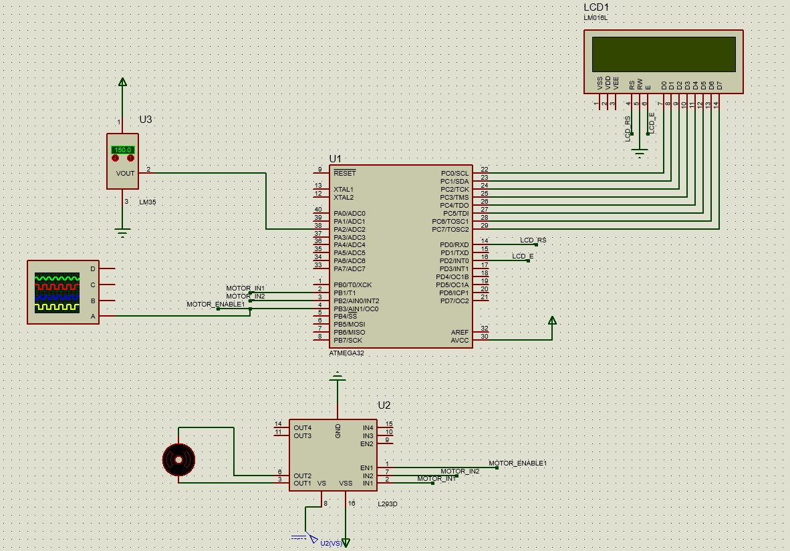

# Fan Controller

## Project Description

This is an embedded systems project completed as part of the MT diploma (Embedded Systems Diploma) under the supervision of Engineer Mohamed Tarek.

**Project Name:** Fan Controller  
**Author:** Mohamed Badr  
**Supervisor:** Eng/Mohamed Tarek  

## Project Schematic

## System Requirements

### Overview

The aim of this project is to design a temperature-controlled fan using the ATmega32 microcontroller. The fan is automatically turned ON or OFF based on the temperature readings from the LM35 temperature sensor.

### Specifications

1. **Microcontroller:** ATmega32 with a frequency of 1MHz.
2. **Temperature Sensor:** LM35
3. **Display:** LCD for temperature and fan state.
4. **Fan Control:**
   - Below 30°C: Fan OFF
   - 30-59°C: Fan ON at 25% speed
   - 60-89°C: Fan ON at 50% speed
   - 90-119°C: Fan ON at 75% speed
   - 120°C and above: Fan ON at 100% speed
5. **DC-Motor Speed Control:** PWM signal generated from Timer0.

### Layered Architecture

The project is designed and implemented based on the layered architecture model.
